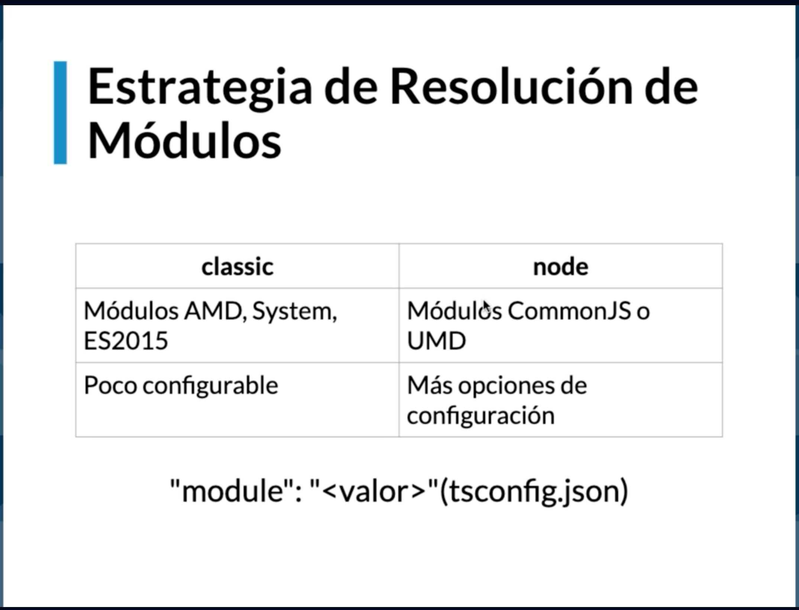
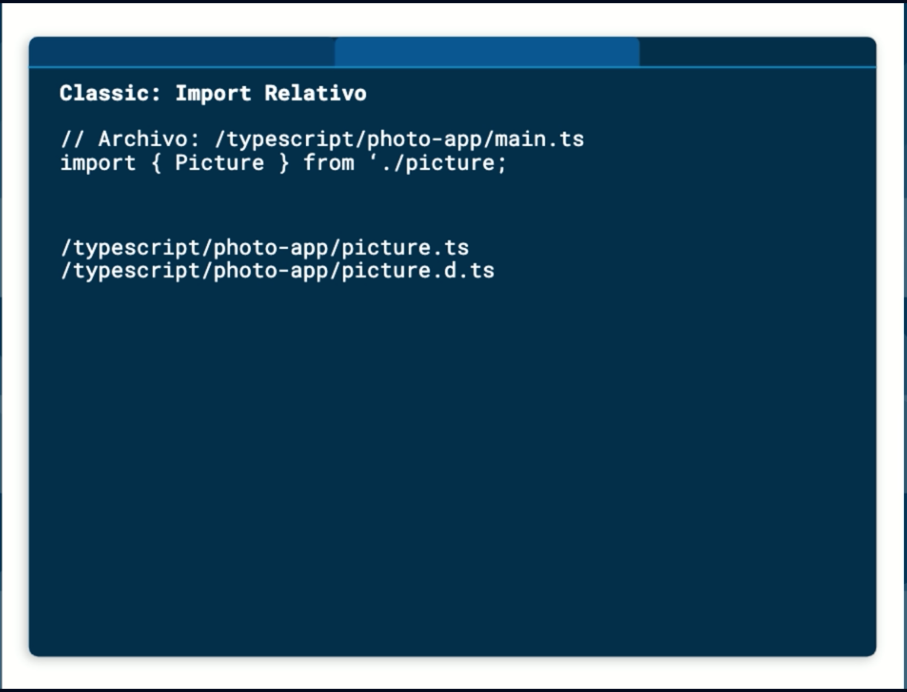
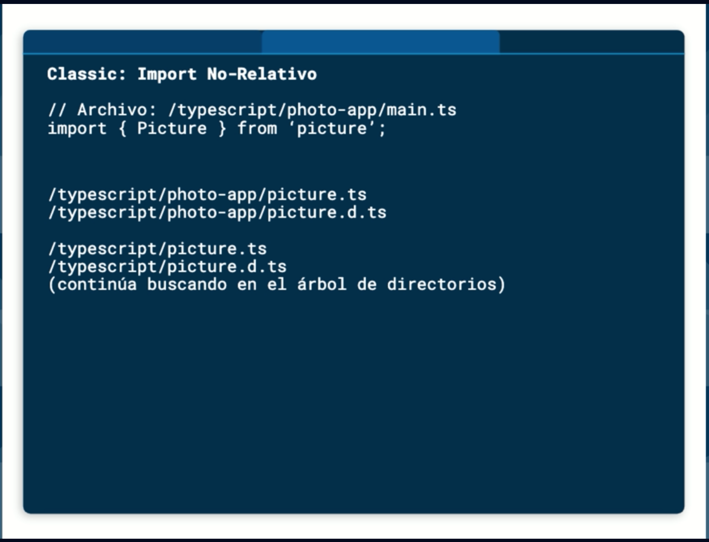
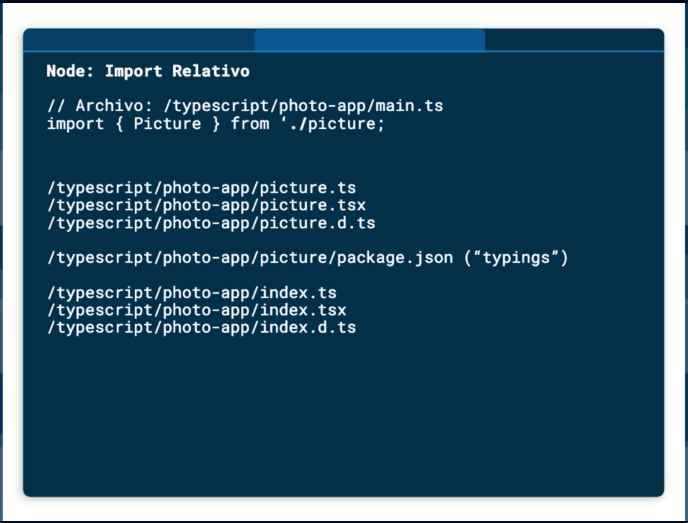
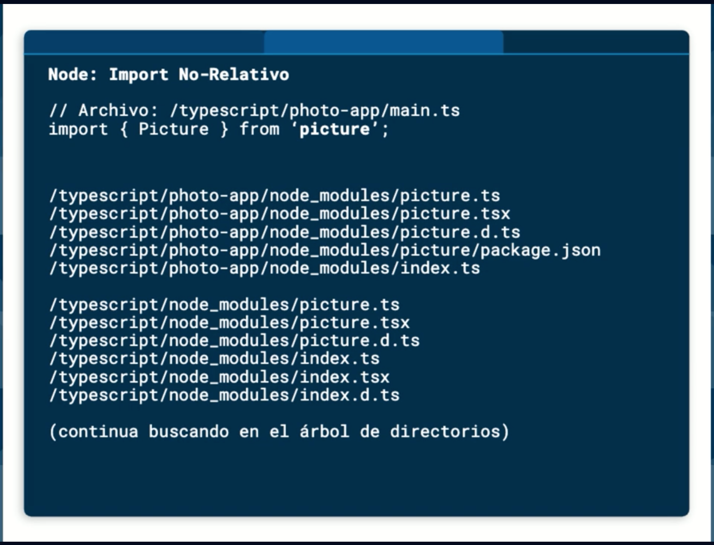

# Fundamentos de TypeScript

TypeScript es un superconjunto tipado de JS, que compila a JS, se puede correr en cualquier navegador o host, es de código abierto, y es un lenguaje de alto nivel.

- [Fundamentos de TypeScript](#fundamentos-de-typescript)
  - [Tools](#tools)
  - [El compilador de TypeScript](#el-compilador-de-typescript)
    - [Opciones adicionales de TSC](#opciones-adicionales-de-tsc)
  - [El archivo de configuración de TypeScript](#el-archivo-de-configuración-de-typescript)
    - [Buscar archivo de configuración](#buscar-archivo-de-configuración)
  - [Salida del archivo JS compilado](#salida-del-archivo-js-compilado)
  - [Tipado en TypeScript](#tipado-en-typescript)
    - [Tipado explícito](#tipado-explícito)
    - [Tipado inferido](#tipado-inferido)
    - [Tipos primitivos en TypeScript](#tipos-primitivos-en-typescript)
      - [Tipo: Number](#tipo-number)
      - [tipo: Booleano](#tipo-booleano)
      - [Tipo: String](#tipo-string)
        - [Template string](#template-string)
      - [Tipo: Any](#tipo-any)
      - [Tipo: Void](#tipo-void)
      - [Tipo: Never](#tipo-never)
      - [Tipo: Null y Undefined](#tipo-null-y-undefined)
        - [Null y Undefined como subtipos](#null-y-undefined-como-subtipos)
      - [Tipo: object](#tipo-object)
      - [Tipo: Array](#tipo-array)
      - [Tipo: Tupla](#tipo-tupla)
      - [Tipo: Enum](#tipo-enum)
    - [Unión de tipos, alias y tipos literales](#unión-de-tipos-alias-y-tipos-literales)
    - [Aserciones de tipo](#aserciones-de-tipo)
    - [Funciones en TypeScript](#funciones-en-typescript)
      - [Tipo de retorno con TypeScript](#tipo-de-retorno-con-typescript)
    - [Interfaces en TypeScript](#interfaces-en-typescript)
      - [Propiedades opcionales en interfaces](#propiedades-opcionales-en-interfaces)
      - [Propiedades de solo lectura](#propiedades-de-solo-lectura)
      - [Extendiendo interfaces](#extendiendo-interfaces)
    - [Clases en TypeScript](#clases-en-typescript)
      - [Clases: Miembros públicos](#clases-miembros-públicos)
      - [Clases: Miembros privados](#clases-miembros-privados)
      - [Classes: Miembros privados ECMAScript](#classes-miembros-privados-ecmascript)
      - [Classes: Métodos Set y Get](#classes-métodos-set-y-get)
      - [Herencias de clases y miembros protegidos](#herencias-de-clases-y-miembros-protegidos)
      - [Clases abstractas](#clases-abstractas)
      - [Propiedades estáticas y propiedades de solo lectura](#propiedades-estáticas-y-propiedades-de-solo-lectura)
    - [Módulos en TypeScript](#módulos-en-typescript)
      - [Importando y exportando módulos en TypeScript](#importando-y-exportando-módulos-en-typescript)
    - [Principio de responsabilidad única](#principio-de-responsabilidad-única)
    - [Recsolviendo módulos](#recsolviendo-módulos)
    - [Webpack y agrupación de módulos](#webpack-y-agrupación-de-módulos)
      - [Aegragando el archivo package.json](#aegragando-el-archivo-packagejson)
      - [Instalación de TypeScript y Webpack](#instalación-de-typescript-y-webpack)
      - [Creamos nuestro archivo de configuración de webpack](#creamos-nuestro-archivo-de-configuración-de-webpack)
      - [Agregar ts-loader para webpack](#agregar-ts-loader-para-webpack)

## Tools

Dentro de las herramientas necesarias, vamos a instalar Node y VSCode.

NOTA! VSCode viene configurado para aprovechar al máximo TypeScript, lo que hace el desarrollo de proyectos con TypeScript mucho más eficientes y divertidos de codear. Algunas de las ventajas que tenemos con VSCode:

- IntelliSense
- Snippets
- JSDocs
- Formateo
- Refactorización
- Arreglos rápidos

## El compilador de TypeScript

Denominado TSC (TypeScript Compiler). Para instalarlo:

```bash
npm insall -g typescript

# Verificamos que esté correctamente instalada
tsc --version
```

Una manera de compilar un proyecto de TypeScript en Terminal:

```bash
tsc hello.ts # Esto compilará el archivo ingresado y resultará en un nuevo archivo hello.js
```

### Opciones adicionales de TSC

Podemos usar el siguiente command para mantener observando los cambios que se hagan en el archivo TypeScript:

```bash
tsc --watch hello.ts
```

## El archivo de configuración de TypeScript

¿Qué es el archivo de configuración de TypeScript? Nos permite especificar la raíz de un proyecto TypeScript, además, nos da la oportunidad de configurar opciones adicionales del compilador.

Para generar este archivo en nuestros proyectos, solo basta correr el comando:

```bash
tsc --init
```

Un ejemplo del archivo generado:

```json
// tsconfig.json
{
  "extends": "./configs/base",
  "compileOnSave": true,
  "compilerOptions": {
    "target": "ES5", // ES3, ES5, ES6, ES2017, ES2018, ES2020
    "module": "commonjs", // Configuración para generación de modulos en TypeScript: NOM, commonjs, AMD, System, otros
    "strict": true, // Habilitar la verificación estricta en nuestro TypeScript
    "removeComments": true
  },
  "include": [
    "src/**/*.ts"
  ],
  "exclude": [
    "node_modules",
    "**/*.test.ts"
  ]
}
```

### Buscar archivo de configuración

Los siguientes comandos nos permiten correr nuestros proyectos de TypeScript en diferentes modos:

```bash
tsc # Busca en las diferentes carpetas el archivo de configuración
tsc --project platzi # Especifica un directorio que contiene la configuración
tsc file.ts # Omite la configuración
```

## Salida del archivo JS compilado

En el archivo generado al correr `tsc --init` encontramos un parámetro llamado `outDir`, en el que definimos dónde vamos a querer que se compile el proyecto en JS.

```json
{
  "compilerOptions": {
    "outDir": "./dist"
  }
}
```

## Tipado en TypeScript

En el lenguaje de programación de TypeScript podemos definir variables de las siguientes formas:

1. Explícita: Define una sitaxis para la creación de variables con tipo de dato.
2. Inferido: TypeScript tiene la habilidad de deducir el tipo de función de un valor.

### Tipado explícito

Para definir una variable en modo explícito, debemos definir la variable en notación post fija:

```typescript
// nombreVariable: Tipo de Dato - Los dos puntos, permiten especificar el tipo de dato
```

### Tipado inferido

Para hacerlo ahora en modo inferido, debemos tener el nombre de la variable y esta debe tener un valor inicial:

```typescript
// nombreVariable = Valor - Dependiendo del valor inicial, TypeScript se encargará de definir el tipo y lo asigna
```

### Tipos primitivos en TypeScript

Los tipos que TypeScript tiene en su lista de básicos son:

1. Number
2. Boolean
3. String
4. Array
5. Tuple
6. Enum
7. Any
8. Void
9. Null
10. Undefined
11. Never
12. Object

#### Tipo: Number

Podemos considerar los:

1. Valores numéricos
2. Valores hexadecimales
3. Valores binarios
4. Valores octales

Algunos ejemplos:

```typescript
// Explícito
let phone: number;
phone = 12;
// phone = 'Hello'; // Error por tipo

// Inferido
let phoneNumber = 2;
// phoneNumber = null; // Error por tipo

// Otros ejemplos
let hex: number = 0xf00d; // Datos hexadecimales
let binary: number = 0b1001; // Datos binarios
let octal: number = 0o744; // Datos octales
```

#### tipo: Booleano

Es el tipo de dato más simple en TypeScript, ya que solo se pueden definir dos valores: `true` y `false`. Algunos ejemplos:

```typescript
// Explícito
let isValid: boolean;
isValid = true;
// isValid = 'Yes'; // Error de tipo

// Inferido
let isUserValid = true;
// isUserValid = 'No'; // Error de tipo
```

#### Tipo: String

Es el tipo de datos para trabajar con datos textuales o cadenas. De la misma manera que en JS, se pueden usar comillas dobles o simples. Algunos ejemplos:

```typescript
// Explícito
let firstName: string = 'Alex';
// firstName = 23; // Error de tipo

// inferido
let lastName = 'Romero';
// lastName = true; // Error de tipo
```

##### Template string

Permite definir múltiples líneas de texto; pueden contener expresiones o variables embebidas; se debe usar el caracter backtick/backquote(_`_) y para expresiones _${exp}_. Algunos ejemplos:

```typescript
// Template string
// Uso de backtick `
let userInfo: string;
userInfo = `
  User Info:
  firstName: ${firstName}
  lastName: ${lastName}
  phone: ${phone}
  isValid: ${isValid}
`;
```

#### Tipo: Any

Se usa para valores dinámicos; dichos valores pueden cambiar de tipo a través del tiempo, como ejemplo:

- APIs externas
- Librerías de terceros

Algunos ejemplos:

```typescript
// Explícito
let userId: any;
userId = 1;
userId = '1';
console.log('userId: ', userId);

let surprise: any = 'Hello TypeScript';
// surprise.sayHello(); // Error de ejecución
const res = surprise.substring(6); // Posible error futuro
console.log('res: ', res);

// Implícito
let otherId;
otherId = 1;
otherId = '1';
console.log('otherId: ', otherId);
```

Es importante recordar que solo se puede usar el tipo _any_ cuando no estés seguro del tipo de dato exacto que se almacenará en tu variable. Por lo que, no debería ser el tipo por defecto para tu código en TypeScript.

#### Tipo: Void

Es lo opuesto a `any`, ya que representa ausencia de tipo; es usado comúnmente como tipo de retorno de funciones. Algunos ejemplos:

```typescript
// Explícito
function showInfo(user: any): void {
  console.log('user info: ', user.id, user.firstName, user.lastName);
}

const showInfoArrow = (user: any): void => {
  console.log('user info: ', user.id, user.firstName, user.lastName);
}

// Inferido
function showFormattedInfo(user: any) {
  console.log('formatted info: ', `
    id: ${user.id}
    firstName: ${user.firstName}
    lastName: ${user.lastName}
  `);
}

// Tipo: Void, como tipo de dato en una variable
let unusable: void;
unusable = null; // En el modo strict esto marca error, pero puede ponerse en false y es aceptado
unusable = undefined; // En el modo strict esto marca error, pero puede ponerse en false y es aceptado
```

Con este último ejemplo podemos descubrir que `null` y `undefined` son un subtipo de `void`.

#### Tipo: Never

Representa el tipo de valor que nunca ocurre, por ejemplo:

- Funciones que lanzan excepciones
- Funciones que nunca retornan un valor

Algunos ejemplos:

```typescript
// Explícito
function handleError(code: number, message: string): never {
  // Se procesa el código
  // Se genera un mensaje
  throw new Error(`${message}. Code ${code}`);
}

try {
  handleError(404, 'Not found');
} catch(error) {}

const handleErrorArrow = (code: number, message: string): never => {
  // Se procesa el código
  // Se genera un mensaje
  throw new Error(`${message}. Code ${code}`);
}

try {
  handleError(404, 'Not found');
} catch(error) {}

function sumNumbers(limit: number): never {
  let sum = 0;
  while(true) {
    sum++;
  }
}

sumNumbers(10); // Ciclo infinito, el programa nunca termina
```

#### Tipo: Null y Undefined

En TypeScript, ambos 'valores' tienen sus respectivos tipos:

- null
- undefined

Algunos ejemplos:

```typescript
// Explícito
let nullVariable: null;
nullVariable = null;
// nullVariable = 12; // Error de tipo

// Inferido
let otherVariable = null;
otherVariable = 'Hello';

console.log('null variable: ', nullVariable);
// console.log('other variable: ', otherVariable); // Error de unreachable code detected

// Explícito
let undefinedVariable: undefined = undefined;
// undefinedVariable = 'Hi'; // Error de tipo

// Inferido
let otherUndefinedVariable = undefined;
otherUndefinedVariable = 12;

console.log('undefined variable: ', undefinedVariable);
// console.log('other undefined variable: ', otherUndefinedVariable); // Error de unreachable code detected
```

Es importante recalcar que tanto `null` como `undefined`, pueden ser considerados subtipos de los otros tipos de datos; esto significa que, se puede asignar `null` o `undefined` a una variable de tipo string, por ejemplo.

##### Null y Undefined como subtipos

Existe una opción en el archivo de config que nos puede ayudar a evitar errores de compilación que se pueden presentar al cambiar de `number` a `null` o `undefined` (por ejemplo).

- La opción --strictNullChecks

Solo permite asignar `null` y `undefined` a una variable tipo any o sus tipos respectivos; ayuda a evitar errores comunes en programación de Apps en el ámbito de JS.

Se puede activar de dos formas, la primera con un flag al correr tsc:

```bash
tsc /src/null-undefined.ts --strictNullChecks
```

La segunda forma, en el archivo de configuración de TypeScript:

```json
{
  "compilerOptions": {
    "strictNullChecks": true
  }
}
```

#### Tipo: object

Es el tipo de dato que representa un valor no primitivo; osea, para variables que no sean `number`, `string`, `boolean`, `null`, `undefined`, etc.

Algunos ejemplos:

```typescript
// Explícito
let user: object;
user = {};
user = {
  id: 'asdr',
  firstName: 'Alex',
  lastName: 'Romero'
}

console.log('user: ', user);
// console.log('user id: ', user.id); // Error Property 'id' does not exist on type 'object'
```

Como **NOTA**, es importante tener en cuenta la diferencia entre Object y object:

- Object: instancia de la clase Object de JS
- object: tipo para valores no primitivos

Con este tipo, no se puede acceder a las propiedades del objeto. Algunos ejemplos:

```typescript
// Object VS object (Clase JS VS tipo TS)
const myObject = {
  id: 'asdr',
  firstName: 'Alex',
  lastName: 'Romero'
}

const isInstance = myObject instanceof Object; // Clase Object de JS
console.log('isInstance: ', isInstance);
```

#### Tipo: Array

De la misma manera que JS, TypeScript nos permite definir un arreglo para contener un conjunto de valores; este tipo usa dos tipos de valores: `[]` y `Array<tipo>`. Algunos ejemplos:

```typescript
// Explícito
let users: string[];
users = ['hello', 'world'];
// users = [12, true, 'test']; // Error de tipo

// Inferido
let usersInferido = ['hello', 'world'];
// usersInferido = [12, true, 'test']; // Error de tipo

// Array<tipo>
let pictureTitles: Array<string>;
pictureTitles = ['Faces', 'Family', 'Church'];

// Accediendo a los valores de un Array
console.log('first user: ', users[0]);

// Propiedades en Array
console.log('users length: ', users.length);

// Uso de funciones en Array
users.push('platziUser');
users.sort((a, b) => (a > b ? 1 : -1));
```

#### Tipo: Tupla

Las tuplas nos permiten representar un arreglo con un número fijo de elementos, además de que los tipos de datos son conocidos. Como **NOTA Importante**, para cumplir con el uso del tipo tupla, las variables deben ser de diferente tipo.

Algunos ejemplos:

```typescript
// Explícito
let userTupla: [number, string]; // [12, 'Jesus'];
userTupla = [1, 'Uno'];
// userTupla = ['hello', 'world']; // Error de tipo

console.log('userTupla: ', userTupla);
console.log('name: ', userTupla[1]);
console.log('name: ', userTupla[1].length); // Al agregar el punto, TypeScript nos devuelve funciones relacionadas con strings
console.log('id: ', userTupla[0]);
console.log('id: ', userTupla[0].toExponential); // Al agregar el punto, TypeScript nos devuelve funciones relacionadas con numbers

// Tuplas con varios valores
let userInfoTupla: [number, string, boolean];
userInfoTupla = [12, 'Jesus', true];
console.log('userInfoTupla: ', userInfoTupla);

// Arreglo de tuplas
let tuplaArray: [number, string][] = []; // Se inicializa un array que dentro va a contener arrays de number, string
tuplaArray.push([1, 'Uno']);
tuplaArray.push([2, 'Dos']);
tuplaArray.push([3, 'Tres']);
console.log('tupla array: ', tuplaArray);
tuplaArray[2][1] = tuplaArray[2][1].concat('001'); // [3, 'Tres001]
console.log('tupla array: ', tuplaArray);
```

#### Tipo: Enum

Los enumerados en TypeScript, permiten definir un conjunto de constantes con nombre; tienen la ventaja de adaptarse al contexto de la aplicación. Algunos ejemplos:

```typescript
// Explícito
// La manera tradicional de hacerlo en JS
/* const landscape = 1;
const square = 2;
const wide = 3;
const panorama = 4; */

enum PhotoOrientation {
  Landscape = 0, // 0
  Square = 1, // 1
  Wide = 2, // 2
  Panorama = 3 // 3
}

const landscape: PhotoOrientation = PhotoOrientation.Landscape;
console.log('landscape number: ', landscape);
console.log('landscape name: ', PhotoOrientation[landscape]);

enum PictureOrientation {
  Landscape = 10, // 10
  Square, // 11
  Wide, // 12
  Panorama // 13
}
console.log('picture orientation wide: ', PictureOrientation.Wide); // 12

enum Country {
  Bolivia = 'bol',
  Colombia = 'col',
  Mexico = 'mex',
  Brasil = 'bra',
}
const country: Country = Country.Mexico;
console.log('country: ', country); // mex
```

### Unión de tipos, alias y tipos literales

- Unión de tipos

En TypeScript se puede definir una variable con múltiples tipos de datos: Union Type; se usa el símbolo de pipe (_'|'_) entre los tipos. Algunos ejemplos:

```typescript
// Unión de tipos
let usuarioId: number | string;
usuarioId = 10;
usuarioId = '10';

function getUsuarioById(id: number | string) {
  // Lógica de negocio
  return 'Jesus';
}
```

- Alias de tipos

TypeScript permite crear un alias como nuevo nombre para un tipo; dicho alias puede aplicar también a un conjunto o combinación de tipos; la palabra reservada para esto es `type`. Algunos ejemplos:

```typescript
// Alias de tipos
type UsuarioAlias = number | string;
type Usuario = string;
let usuarioAliasId: UsuarioAlias;
usuarioAliasId = 10;
usuarioAliasId = '10';

function getUsuarioAliasById(id: UsuarioAlias): Usuario {
  // Lógica de negocio
  return 'Jesus';
}
```

- Tipos literales

Una variable con un tipo literal, puede contener únicamente una cadena de conjunto; se usan cadenas como 'tipos', combinados con el símbolo pipe (`'|'`) entre ellos. Algunos ejemplos:

```typescript
// Tipos literales
type SquareSize = '100x100' | '500x500' | '1000x1000';
// const smallPicture: SquareSize = "200x200"; // Error Type '"200x200"' is not assignable to type 'SquareSize'
const smallPicture: SquareSize = "100x100";
const mediumPicture: SquareSize = "500x500";
```

### Aserciones de tipo

Cuando el programador puede conocer más que TypeScript sobre el valor de una variable; es un mensaje al compilador: 'Confía en mí, sé lo que hago'. Es parecido al casting de tipos en otros lenguajes de programación; usa dos sintaxis: `<Angle Bracket>` y (`variable as tipo`). Algunos ejemplos:

```typescript
// Aserciones de tipo
// <tipo> || Angle Brackets syntax
let asertionName: any;
asertionName = 'jesusRomero';

let message: string = (<string>asertionName).length > 5
  ? `Welcome ${asertionName}`
  : 'Asertion name too short';
console.log('message: ', message); // Welcome jesusRomero

let asertionNameWithId: any = 'alejandro 1';
// Cómo obtener username?
asertionName = (<string>asertionNameWithId).substring(0, 8);
console.log('asertionName: ', asertionName); // alejandro

// Sintaxis as
let messageAs: string = (asertionName as string).length > 5
  ? `Welcome ${asertionName}`
  : 'Asertion name too short';
console.log('message as: ', messageAs); // Welcome jesusRomero

let asertionNameWithIdAs: any = 'alejandro 1';
// Cómo obtener username?
asertionName = (asertionNameWithIdAs as string).substring(0, 8);
console.log('asertionName: ', asertionName); // alejandro
```

### Funciones en TypeScript

Los parámetros en las funciones son tipados; se pueden definir parámetros opcionales; el tipo de retorno puede ser un tipo básico, enum, alias, tipo literal o una combinación de ellos. Algunos ejemplos:

```typescript
// Funciones en TypeScript
type SquareSizes = '100x100' | '500x500' | '1000x1000';
function createPictureFunc(title: string, date: string, size: SquareSizes) {
  // Se crea la fotografía
  console.log('create picture using: ', title, date, size);
}

createPictureFunc('hello', 'martes', '500x500');
// createPictureFunc('hello', 'martes'); // Error, hace falta el tercer parámetro

// Uso de parámetros opcionales
function createPictureOptFunc(title: string, date: string, size?: SquareSizes) {
  // Se crea la fotografía
  console.log('create picture using: ', title, date, size);
}

createPictureOptFunc('hello', 'martes', '500x500');
createPictureOptFunc('hello', 'martes');

// Flat array function
let createPic = (title: string, date: string, size: SquareSizes): object => {
  return { title, date, size };
}

const pic001 = createPic('hello', 'martes', '1000x1000');
console.log('pic001: ', pic001);
```

#### Tipo de retorno con TypeScript

Algunos ejemplos:

```typescript
// Tipo de retorno con TypeScript
function handleNewError(code: number, message:string): never | string {
  // Procesamiento
  if (message === 'error') {
    throw new Error(`${message}. Code error: ${code}`);
  } else {
    return 'An error has ocurred';
  }
}

let newResult = handleNewError(200, 'OK'); // string
console.log('new result: ', newResult);
newResult = handleNewError(400, 'Error'); // never
console.log('new result: ', newResult);

try {
  let newResult = handleNewError(200, 'OK'); // string
  console.log('new result: ', newResult);
  newResult = handleNewError(400, 'Error'); // never
  console.log('new result: ', newResult);
} catch(error) {}
```

### Interfaces en TypeScript

Estas constituyen una forma poderosa de definir 'contratos', tanto para un proyecto, como para el código externo mismo. [Aquí](https://www.typescriptlang.org/docs/handbook/interfaces.html) podemos ver la definición completa de las interfaces y su modo de uso. Algunos ejemplos:

```typescript
// Interfaces
enum PhotoOrientationInt {
  Landscape, // 0
  Square, // 1
  Wide, // 2
  Panorama // 3
};

function showPictureInt(picture: { title: string, date: string, orientation: PhotoOrientationInt }) {
  console.log(`
    [
      title: ${picture.title},
      date: ${picture.date},
      orientation: ${picture.orientation}
    ]
  `)
}

const myPicInt = {
  title: 'Test',
  date: 'martes',
  orientation: PhotoOrientationInt.Landscape
}

showPictureInt(myPicInt);
showPictureInt({
  title: 'Test',
  date: 'martes',
  orientation: PhotoOrientationInt.Landscape,
  // extra: 'extra' // Error porque no es parte del contrato original definido arriba
})

// Creación de una interfaz
interface Picture {
  title: string,
  date: string,
  orientation: PhotoOrientationInt
}

function showInterfacedPicture(picture: Picture) {
  console.log(`
    [
      title: ${picture.title},
      date: ${picture.date},
      orientation: ${picture.orientation}
    ]
  `)
}
```

#### Propiedades opcionales en interfaces

No todas las propiedades de una interfaz podrían ser requeridas; se establece una propiedad como opcional con el símbolo _?_ después del nombre. Algunos ejemplos:

```typescript
// Propiedades opcionales en interfaces
interface PictureConfig {
  title?: string,
  date?: string,
  orientation?: PhotoOrientationInt
}

function generatePictureInt(config: PictureConfig) {
  const pic = {
    title: 'default',
    date: 'default'
  };
  if (config.title) {
    pic.title = config.title;
  }
  if (config.date) {
    pic.date = config.date;
  }

  return pic;
}

let pictureInt = generatePictureInt({});
console.log('picture int: ', pictureInt);
pictureInt = generatePictureInt({ title: 'Hola' });
console.log('picture int: ', pictureInt);
pictureInt = generatePictureInt({ title: 'Hola', date: 'mañana' });
console.log('picture int: ', pictureInt);
```

#### Propiedades de solo lectura

Algunas propiedades de la interfaz podrían no ser modificables una vez creado el objecto; se puede lograr usando `readonly` antes del nombre de la propiedad. Algunos ejemplos:

```typescript
// Propiedades de solo lectura
interface UsuarioIntRO {
  readonly id: number,
  username: string,
  isPro: boolean
}

let userIntRO: UsuarioIntRO;
userIntRO = {
  id: 12,
  username: 'jesuskata',
  isPro: true
}
console.log('user int readonly: ', userIntRO);
userIntRO.username = 'paparazzi';
console.log('user int readonly: ', userIntRO);
// userIntRO.id = 14; // Error, debido a que se definió como un atributo de solo lectura
```

#### Extendiendo interfaces

Las interfaces pueden extenderse unas de otras. Esto permite copiar los miembros ya definidos en una interfaz a otra, ganando flexibilidad y reusabilidad de componentes. Algunos ejemplos:

```typescript
// Extendiendo interfaces
enum PhotoOrientationExt {
  Landscape, // 0
  Square, // 1
  Wide, // 2
  Panorama // 3
};

interface EntityExt {
  id: number,
  title: string
};

interface AlbumExt extends EntityExt {
  // Con la palabra reservada y la conexión a la entidad, ya tenemos una copia de los atributos de la entidad (id, title)
  description: string
};

interface PictureExt extends EntityExt {
  // Con la palabra reservada y la conexión a la entidad, ya tenemos una copia de los atributos de la entidad (id, title)
  orientation: PhotoOrientationExt
};

const albumExtExample: AlbumExt = {
  id: 12,
  title: 'memories',
  description: 'desde 2020'
};

const pictureExtExample: PictureExt = {
  id: 1,
  title: '12122021-pic001',
  orientation: PhotoOrientationExt.Wide
};

let newPictureExtExample = {} as PictureExt;
newPictureExtExample.id = 3;
newPictureExtExample.title = '06012021-pic001';
console.log('album example: ', albumExtExample);
console.log('picture extended example: ', pictureExtExample);
console.log('new picture extended example: ', newPictureExtExample);
```

### Clases en TypeScript

Recordemos que una clase es la abstracción de un objeto. A partir de ES5 es posible construir clases y hacer uso del paradigma de la Programación Orientada a Objetos en JS; TypeScript, permite aplicar estas técnicas sin tener que esperar por otra versión.

Algunos ejemplos:

```typescript
// Clases en TypeScript
enum PhotoOrientationClass {
  Landscape, // 0
  Square, // 1
  Wide, // 2
  Panorama // 3
};

class PictureClass {
  // Propiedades
  id: number;
  title: string;
  orientation: PhotoOrientationClass;

  constructor(id: number, title: string, orientation: PhotoOrientationClass) {
    this.id = id;
    this.title = title;
    this.orientation = orientation;
  };

  // Comportamiento
  toString() {
    return `
      [
        id: ${this.id},
        title: ${this.title},
        orientation: ${this.orientation}
      ]
    `
  }
}

class AlbumClass {
  // Propiedades
  id: number;
  title: string;
  pictures: PictureClass[];

  constructor(id: number, title: string) {
    this.id = id;
    this.title = title;
    this.pictures = [];
  };

  // Comportamiento
  addPicture(picture: PictureClass) {
    this.pictures.push(picture);
  }
}

const newAlbumClassExample: AlbumClass = new AlbumClass(1, 'Fotos de familia');
const newPictureClassExample: PictureClass = new PictureClass(33, 'photo', PhotoOrientationClass.Panorama);
newAlbumClassExample.addPicture(newPictureClassExample);
console.log('new album class example: ', newAlbumClassExample);
```

#### Clases: Miembros públicos

TypeScript define un modificador de acceso público por defecto para los miembros de clase; tembién es posible marcar un miembro como público usando la palabra reservada `public`. Algunos ejemplos:

```typescript
enum PhotoOrientationClass {
  Landscape, // 0
  Square, // 1
  Wide, // 2
  Panorama // 3
};

class PictureClass {
  // Propiedades
  public id: number;
  public title: string;
  public orientation: PhotoOrientationClass;

  public constructor(id: number, title: string, orientation: PhotoOrientationClass) {
    this.id = id;
    this.title = title;
    this.orientation = orientation;
  };

  // Comportamiento
  public toString() {
    return `
      [
        id: ${this.id},
        title: ${this.title},
        orientation: ${this.orientation}
      ]
    `
  }
}

class AlbumClass {
  // Propiedades
  public id: number;
  public title: string;
  public pictures: PictureClass[];

  public constructor(id: number, title: string) {
    this.id = id;
    this.title = title;
    this.pictures = [];
  };

  // Comportamiento
  public addPicture(picture: PictureClass) {
    this.pictures.push(picture);
  }
}

const newAlbumClassExample: AlbumClass = new AlbumClass(1, 'Fotos de familia');
const newPictureClassExample: PictureClass = new PictureClass(33, 'photo', PhotoOrientationClass.Panorama);
newAlbumClassExample.addPicture(newPictureClassExample);
console.log('new album class example: ', newAlbumClassExample);

// Accediendo a los miembros públicos
newPictureClassExample.id = 100; // public
newPictureClassExample.title = 'New name'; // public
newAlbumClassExample.title = 'New album'; // public
console.log('new album class example: ', newAlbumClassExample);
```

#### Clases: Miembros privados

TypeScript define una manera propia de declarar o marcar un miembro como privado, usando la palabra reservada `private`. Algunos ejemplos:

```typescript
enum PhotoOrientationClass {
  Landscape, // 0
  Square, // 1
  Wide, // 2
  Panorama // 3
};

class PictureClass {
  // Propiedades
  private id: number;
  private title: string;
  private orientation: PhotoOrientationClass;

  public constructor(id: number, title: string, orientation: PhotoOrientationClass) {
    this.id = id;
    this.title = title;
    this.orientation = orientation;
  };

  // Comportamiento
  public toString() {
    return `
      [
        id: ${this.id},
        title: ${this.title},
        orientation: ${this.orientation}
      ]
    `
  }
}

class AlbumClass {
  // Propiedades
  private id: number;
  private title: string;
  private pictures: PictureClass[];

  public constructor(id: number, title: string) {
    this.id = id;
    this.title = title;
    this.pictures = [];
  };

  // Comportamiento
  public addPicture(picture: PictureClass) {
    this.pictures.push(picture);
  }
}

const newAlbumClassExample: AlbumClass = new AlbumClass(1, 'Fotos de familia');
const newPictureClassExample: PictureClass = new PictureClass(33, 'photo', PhotoOrientationClass.Panorama);
newAlbumClassExample.addPicture(newPictureClassExample);
console.log('new album class example: ', newAlbumClassExample);

// Miembros públicos
newPictureClassExample.id = 100; // Error Property 'id' is private and only accessible within class 'PictureClass'
newPictureClassExample.title = 'New name'; // Error Property 'id' is private and only accessible within class 'PictureClass'
newAlbumClassExample.title = 'New album'; // Error Property 'title' is private and only accessible within class 'AlbumClass'
console.log('new album class example: ', newAlbumClassExample);
```

#### Classes: Miembros privados ECMAScript

TypeScript también soporta (a partir de la versión 3.8) la nueva syntaxis JS para miembros privados: `#atributo`; esta característica puede ofrecer mejores garantías de aislamiento en miembros privados. Algunos ejemplos:

```typescript
enum PhotoOrientationClass {
  Landscape, // 0
  Square, // 1
  Wide, // 2
  Panorama // 3
};

class PictureClass {
  // Propiedades
  #id: number;
  #title: string;
  #orientation: PhotoOrientationClass;

  public constructor(id: number, title: string, orientation: PhotoOrientationClass) {
    this.#id = id;
    this.#title = title;
    this.#orientation = orientation;
  };

  // Comportamiento
  public toString() {
    return `
      [
        id: ${this.#id},
        title: ${this.#title},
        orientation: ${this.#orientation}
      ]
    `
  }
}

class AlbumClass {
  // Propiedades
  #id: number;
  #title: string;
  #pictures: PictureClass[];

  public constructor(id: number, title: string) {
    this.#id = id;
    this.#title = title;
    this.#pictures = [];
  };

  // Comportamiento
  public addPicture(picture: PictureClass) {
    this.#pictures.push(picture);
  }
}

const newAlbumClassExample: AlbumClass = new AlbumClass(1, 'Fotos de familia');
const newPictureClassExample: PictureClass = new PictureClass(33, 'photo', PhotoOrientationClass.Panorama);
newAlbumClassExample.addPicture(newPictureClassExample);
console.log('new album class example: ', newAlbumClassExample);

// Accediendo a los miembros públicos
// newPictureClassExample.id = 100; // public
// newPictureClassExample.title = 'New name'; // public
// newAlbumClassExample.title = 'New album'; // public
console.log('new album class example: ', newAlbumClassExample);

// Accediendo a los miembros públicos
// newPictureClassExample.id = 100; // Error Property 'id' is private and only accessible within class 'PictureClass'
// newPictureClassExample.title = 'New name'; // Error Property 'id' is private and only accessible within class 'PictureClass'
// newAlbumClassExample.title = 'New album'; // Error Property 'title' is private and only accessible within class 'AlbumClass'
console.log('new album class example: ', newAlbumClassExample);
```

#### Classes: Métodos Set y Get

TypeScript soporta los métodos accesores `set` y `get` como una forma de interpretar los accesos a los miembros privados de un objeto. Algunos ejemplos:

```typescript
enum PhotoOrientationClass {
  Landscape, // 0
  Square, // 1
  Wide, // 2
  Panorama // 3
};

class PictureClass {
  // Propiedades
  private _id: number;
  private _title: string;
  private _orientation: PhotoOrientationClass;

  public constructor(id: number, title: string, orientation: PhotoOrientationClass) {
    this._id = id;
    this._title = title;
    this._orientation = orientation;
  };

  get id() {
    return this._id;
  }
  set id(id: number) {
    this._id = id;
  }

  get title() {
    return this._title;
  }
  set title(title: string) {
    this._title = title;
  }

  get orientation() {
    return this._orientation;
  }
  set orientation(o: PhotoOrientationClass) {
    this._orientation = o;
  }

  // Comportamiento
  public toString() {
    return `
      [
        id: ${this._id},
        title: ${this._title},
        orientation: ${this._orientation}
      ]
    `
  }
}

class AlbumClass {
  // Propiedades
  private _id: number;
  private _title: string;
  private _pictures: PictureClass[];

  public constructor(id: number, title: string) {
    this._id = id;
    this._title = title;
    this._pictures = [];
  };

  get id() {
    return this._id;
  }
  set id(id: number) {
    this._id = id;
  }

  get title() {
    return this._title;
  }
  set title(title: string) {
    this._title = title;
  }

  // Comportamiento
  public addPicture(picture: PictureClass) {
    this._pictures.push(picture);
  }
}

const newAlbumClassExample: AlbumClass = new AlbumClass(1, 'Fotos de familia');
const newPictureClassExample: PictureClass = new PictureClass(33, 'photo', PhotoOrientationClass.Panorama);
newAlbumClassExample.addPicture(newPictureClassExample);
console.log('new album class example: ', newAlbumClassExample);

// Accediendo a los miembros por modificadores de acceso
// newPictureClassExample.id = 100; // public
// newPictureClassExample.title = 'New name'; // public
// newAlbumClassExample.title = 'New album'; // public
console.log('new album class example: ', newAlbumClassExample);

// Accediendo a los miembros por modificadores de acceso
newPictureClassExample.id = 100; // Error Property 'id' is private and only accessible within class 'PictureClass'
newPictureClassExample.title = 'New name'; // Error Property 'id' is private and only accessible within class 'PictureClass'
newAlbumClassExample.title = 'New album'; // Error Property 'title' is private and only accessible within class 'AlbumClass'
console.log('new album class example: ', newAlbumClassExample);
```

#### Herencias de clases y miembros protegidos

TypeScript soporta este patrón común en el mundo de la POO; implementa la habilidad de extender código de clases existentes a través de la herencia. Algunos ejemplos:

```typescript
// Herencia de clases y miembros protegidos
enum PhotoOrientationClassHer {
  Landscape, // 0
  Square, // 1
  Wide, // 2
  Panorama // 3
};

// Definimos una SUPERClase
class Item {
  protected _id: number;
  protected _title: string;

  public constructor(id: number, title: string) {
    this._id = id,
    this._title = title
  }

  get id() {
    return this._id;
  }
  set id(id: number) {
    this._id = id;
  }

  get title() {
    return this._title;
  }
  set title(title: string) {
    this._title = title;
  }
}

class PictureClassHer extends Item {
  // Propiedades
  private _orientation: PhotoOrientationClassHer;

  public constructor(id: number, title: string, orientation: PhotoOrientationClassHer) {
    super(id, title); // Llamamos al constructor de la SUPERClase
    // this.id = id;
    // this.title = title;
    this._orientation = orientation;
  };

  get orientation() {
    return this._orientation;
  }
  set orientation(o: PhotoOrientationClassHer) {
    this._orientation = o;
  }

  // Comportamiento
  public toString() {
    return `
      [
        id: ${this._id},
        title: ${this._title},
        orientation: ${this._orientation}
      ]
    `
  }
}

class AlbumClassHer extends Item {
  // Propiedades
  private _pictures: PictureClassHer[];

  public constructor(id: number, title: string) {
    super(id, title); // Llamamos al constructor de la SUPERClase
    this._pictures = [];
  };

  // Comportamiento
  public addPicture(picture: PictureClassHer) {
    this._pictures.push(picture);
  }
}

const newAlbumClassHerExample: AlbumClassHer = new AlbumClassHer(1, 'Fotos de familia');
const newPictureClassHerExample: PictureClassHer = new PictureClassHer(33, 'photo', PhotoOrientationClassHer.Panorama);
newAlbumClassHerExample.addPicture(newPictureClassHerExample);
console.log('new album class example: ', newAlbumClassHerExample);

// Accediendo a los miembros por modificadores de acceso
newPictureClassHerExample.id = 100;
newPictureClassHerExample.title = 'New name';
newAlbumClassHerExample.title = 'New album';
console.log('new album class example: ', newAlbumClassHerExample);

// Accediendo a los miembros por modificadores de acceso
newPictureClassHerExample.id = 100;
newPictureClassHerExample.title = 'New name';
newAlbumClassHerExample.title = 'New album';
console.log('new album class example: ', newAlbumClassHerExample);
```

#### Clases abstractas

Las clases abstractas son la base de donde otras clases podrían derivarse. A diferencia de una `interfaz (interface)`, una clase abstracta puede implementar funciones para sus instancias. Se usa la palabra reservada `abstract`. Algunos ejemplos:

```typescript
// Clases abstractas
abstract class ItemAbstract { // Con la palabra reservada abstract, se se evita su uso como clase para instanciar
  protected _id: number;
  protected _title: string;

  public constructor(id: number, title: string) {
    this._id = id,
    this._title = title
  }

  get id() {
    return this._id;
  }
  set id(id: number) {
    this._id = id;
  }

  get title() {
    return this._title;
  }
  set title(title: string) {
    this._title = title;
  }
}

class PictureClassHerAbs extends ItemAbstract {
  // Propiedades
  private _orientation: PhotoOrientationClassHer;

  public constructor(id: number, title: string, orientation: PhotoOrientationClassHer) {
    super(id, title); // Llamamos al constructor de la SUPERClase
    // this.id = id;
    // this.title = title;
    this._orientation = orientation;
  };

  get orientation() {
    return this._orientation;
  }
  set orientation(o: PhotoOrientationClassHer) {
    this._orientation = o;
  }

  // Comportamiento
  public toString() {
    return `
      [
        id: ${this._id},
        title: ${this._title},
        orientation: ${this._orientation}
      ]
    `
  }
}

class AlbumClassHerAbs extends ItemAbstract {
  // Propiedades
  private _pictures: PictureClassHerAbs[];

  public constructor(id: number, title: string) {
    super(id, title); // Llamamos al constructor de la SUPERClase
    this._pictures = [];
  };

  // Comportamiento
  public addPicture(picture: PictureClassHerAbs) {
    this._pictures.push(picture);
  }
}

const newAlbumClassHerAbsExample: AlbumClassHerAbs = new AlbumClassHerAbs(1, 'Fotos de familia');
const newPictureClassHerAbsExample: PictureClassHerAbs = new PictureClassHerAbs(33, 'photo', PhotoOrientationClassHer.Panorama);
newAlbumClassHerAbsExample.addPicture(newPictureClassHerAbsExample);
console.log('new album class example: ', newAlbumClassHerAbsExample);

// Accediendo a los miembros por modificadores de acceso
newPictureClassHerAbsExample.id = 100;
newPictureClassHerAbsExample.title = 'New name';
newAlbumClassHerAbsExample.title = 'New album';
console.log('new album class example: ', newAlbumClassHerAbsExample);

// Accediendo a los miembros por modificadores de acceso
newPictureClassHerAbsExample.id = 100;
newPictureClassHerAbsExample.title = 'New name';
newAlbumClassHerAbsExample.title = 'New album';
console.log('new album class example: ', newAlbumClassHerAbsExample);

// const absItem = new ItemAbstract(1, 'title'); // Error Cannot create an instance of an abstract class
// console.log('abstract item: ', absItem);
```

#### Propiedades estáticas y propiedades de solo lectura

Las clases por lo general definen atributos y métodos aplicables a las instancias mismas; a través de la palabra reservada `static` se puede definir un miembro visible a nivel de clase.

Al igual que las interfaces, podemos usar la palabra reservada `readonly` para marcar el miembro de una clase como solo lectura.

Algunos ejemplos:

```typescript
abstract class ItemAbstract { // Con la palabra reservada abstract, se se evita su uso como clase para instanciar
  protected readonly _id: number;
  protected _title: string;

  public constructor(id: number, title: string) {
    this._id = id,
    this._title = title
  }

  get id() {
    return this._id;
  }
  // set id(id: number) {
  //   this._id = id;
  // }

  get title() {
    return this._title;
  }
  set title(title: string) {
    this._title = title;
  }
}

class PictureClassHerAbs extends ItemAbstract {
  public static photoOrientation = PhotoOrientationClassHer;
  // Propiedades
  private _orientation: PhotoOrientationClassHer;

  public constructor(id: number, title: string, orientation: PhotoOrientationClassHer) {
    super(id, title); // Llamamos al constructor de la SUPERClase
    // this.id = id;
    // this.title = title;
    this._orientation = orientation;
  };

  get orientation() {
    return this._orientation;
  }
  set orientation(o: PhotoOrientationClassHer) {
    this._orientation = o;
  }

  // Comportamiento
  public toString() {
    return `
      [
        id: ${this._id},
        title: ${this._title},
        orientation: ${this._orientation}
      ]
    `
  }
}

class AlbumClassHerAbs extends ItemAbstract {
  // Propiedades
  private _pictures: PictureClassHerAbs[];

  public constructor(id: number, title: string) {
    super(id, title); // Llamamos al constructor de la SUPERClase
    this._pictures = [];
  };

  // Comportamiento
  public addPicture(picture: PictureClassHerAbs) {
    this._pictures.push(picture);
  }
}

const newAlbumClassHerAbsExample: AlbumClassHerAbs = new AlbumClassHerAbs(1, 'Fotos de familia');
const newPictureClassHerAbsExample: PictureClassHerAbs = new PictureClassHerAbs(33, 'photo', PhotoOrientationClassHer.Panorama);
newAlbumClassHerAbsExample.addPicture(newPictureClassHerAbsExample);
console.log('new album class example: ', newAlbumClassHerAbsExample);

// Accediendo al miembro estático
console.log('PhotoOrientation: ', PictureClassHerAbs.photoOrientation.Landscape);

// Accediendo al miembro solo lectura
// newPictureClassHerAbsExample.id = 100; // Error Cannot assign to 'id' because it is a read-only property
```

### Módulos en TypeScript

Los módulos en TypeScript proveen un mecanismo para una mejor organización del código y promueven su reutilización. A partir de `ECMAScript 2015`, los módulos son parte nativa del lenguaje JS.

#### Importando y exportando módulos en TypeScript

Generalmente se define un módulo con la idea de agrupar código relacionado; podemos tomar criterios en torno a la funcionalidad, features, utilitarios, modelos, etc.

Los miembros del módulo interactúan con el uso de las palabras reservadas `import` y `export`. Como ejemplo de esta sección, aquí se dejan los dos archivos creados para mostrar el uso de los módulos en TS:

```typescript
/********** app.ts **********/
export enum PhotoOrientation {
  Landscape, // 0
  Square, // 1
  Wide, // 2
  Panorama // 3
};

export class User {
  private album: Album[];

  constructor(
    private id: number,
    private username: string,
    private firstName: string,
    private isPro: boolean
  ) {
    this.album = [];
  }

  addAlbum(album: Album) {
    this.album.push(album);
  }
}

export class Item {
  constructor(
    public readonly id: number,
    protected title: string
  ) {

  }
}

export class Album extends Item {
  picture: Picture[];

  constructor(
    id: number,
    title: string
  ) {
    super(id, title);
    this.picture = [];
  }

  addPicture(picture: Picture) {
    this.picture.push(picture);
  }
}

export class Picture extends Item {
  constructor(
    id: number,
    title: string,
    private _date: string,
    private _orientation: PhotoOrientation
  ) {
    super(id, title);
  }

  toString(): string {
    return `
      [
        id: ${this.id},
        title: ${this.title},
        date: ${this._date},
        orientation: ${this._orientation},
      ]
    `;
  }
}

/********** main.ts **********/
import { Album, PhotoOrientation, Picture, User } from './example002-app';

const user = new User(1, 'jesuskata', 'Jesus', true);
const album = new Album(1, 'Pictures001');
const picture = new Picture(1, 'photo001', 'hoy', PhotoOrientation.Square);

// Creando relaciones entre los objetos
 user.addAlbum(album);
 album.addPicture(picture);

 console.log('user: ', user);
```

### Principio de responsabilidad única

Idealmente, un archivo debería tener un propósito o responsabilidad única: definir una clase, una interfaz, un enumerado, etc. Esto mejora la legibilidad de código, facilita su lectura, testing, favorece su mantenimiento. Para los ejemplos de esta sección, se tienen los archivos en este Repo que nos ayudan a identificar lo visto en clase.

### Recsolviendo módulos

TypeScript resuelve la ubicación de los módulos observando referencias relativas. Posteriormente intenta localizar el módulo usando una _estrategia de resolución de módulos_.

```bash
tsc --moduleResolution node
tsc --moduleResolution classic
```

Comparativa de las estrategias de resolución de módulos:



Modo clásico, import relativo



Modo clásico, import no-relativo



Modo Node, import relativo



Modo Node, import no-relativo



Ejemplo de configuración de nuestro archivo `tsconfig.json`:

```json
{
  "compilerOptions": {
    "target": "ES2015",
    "module": "commonjs",
    "outDir": "./dist",
    "strict": true,
    "moduleResolution": "node",
    "traceResolution": true,
    "esModileInterop": true,
    "forceConsistentCasingInFileNames": true
  }
}
```

También existen los path `alias` para evitar los puntos y slash en nuestros proyectos. Esta configuración se define en el `ts.config.json` dentro de `compilerOptions` y así se puede acceder al shortcut `@item` para llegar a la carpeta que se busca.

Como ejemplo, dentro el archivo `index.ts`.

```json
{
  "paths": {
    "@item": ["item/index.ts"],
  }
}
```

Se importa de la siguiente manera:

```typescript
import { Item } from '@item';
```

### Webpack y agrupación de módulos

Webpack es una herramienta habitual, para el desarrollo de aplicaciones web. Se puede hacer uso de esa herramienta junto con TypeScript para el procesamiento de clases y cada uno de los archivos TS.

Es considerado un **empaquetador de módulos**, dicho de otra manera: es un _bundler_, que además, permite la integración con otros `plugins` y otras herramientas adicionales de configuración.

#### Aegragando el archivo package.json

Corremos el siguiente comando:

```bash
npm init -y
```

#### Instalación de TypeScript y Webpack

```bash
npm install typescript webpack webpack-cli --save-dev
```

#### Creamos nuestro archivo de configuración de webpack

Creamos en la raíz de nuestro proyecto el archivo `webpack.config.js`:

```javascript
module.exports = {
  mode: 'production',
  entry: './src/main.ts',
  devtool: 'inline-source-map',
  resolve: {
    extensions: ['.ts', '.js']
  },
  output: {
    filename: 'bundle.js'
  }
}
```

#### Agregar ts-loader para webpack

```bash
npm install ts-loader --save-dev
```
